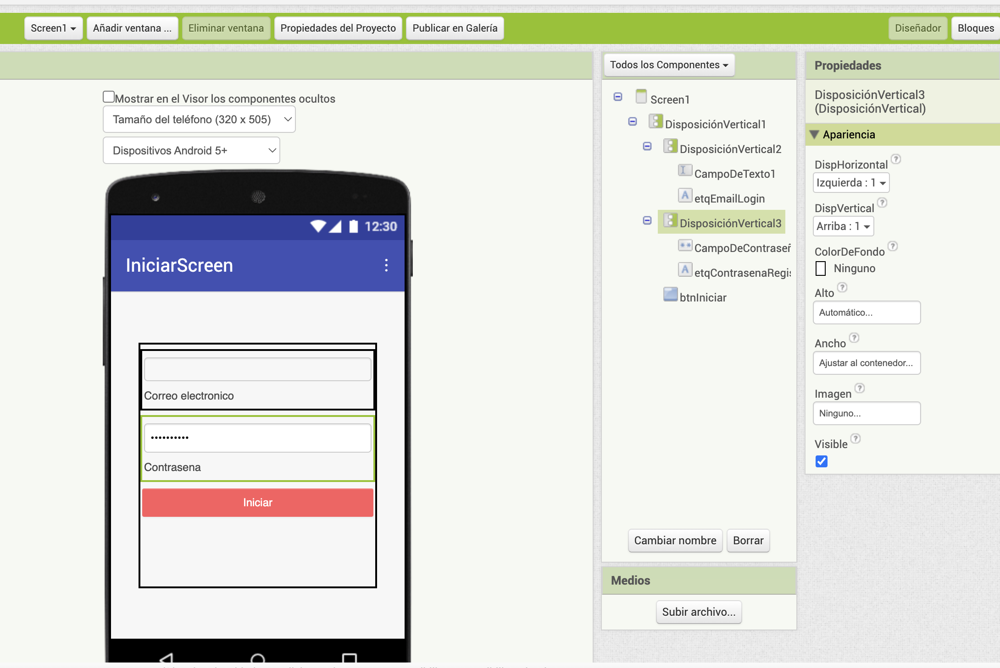
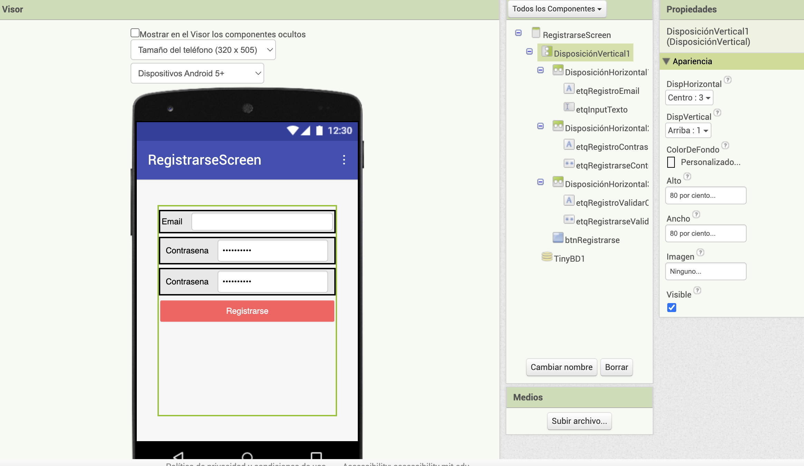
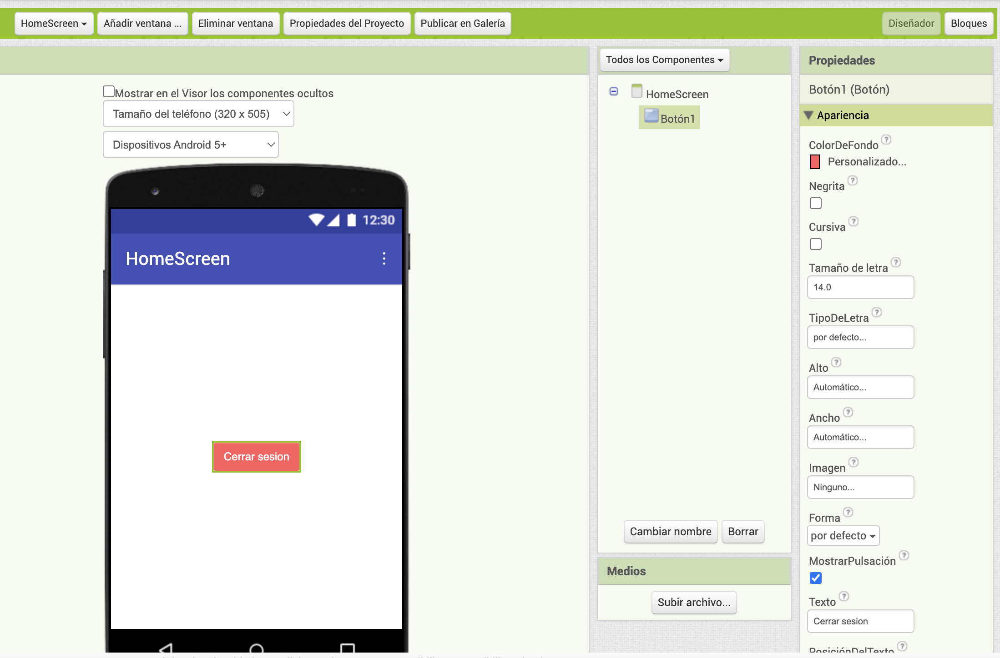

# Practica 1 - 3-parcial

Crear el proyecto nivel intermedio

1. Crear la pantalla de Inicio de Sesion
2. Crear la pantalla de Registro de Sesion

3. Crear las siguientes pantallas.

** Anadir en la pantalla de Login(Iniciar) un TinyDB y otro para RegisterScreen.

Colores
Para el fondo del formulario, en hexadecimal: #F7F7F7
Etiquetas: (Letras: #484848)
Input: Fondo: #484848
Boton: Letras: #fffff, Fondo: #ff5a5f

### Bloques

1. Implementar un procedimiento por pantalla llamados: iniciarSesion, cerrarSesion, registrarse
2. Usar un unico TinyDb
   

